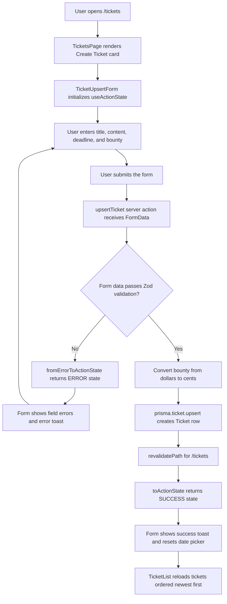

# Feature Flow Diagrams

This document captures user-facing feature flows and the main application modules involved in each flow.

## Create Ticket

The create ticket flow starts on the tickets route, where the page renders the ticket creation form above the existing ticket list.

### Main Modules

- Route composition: `src/app/tickets/page.tsx`
- Create form UI: `src/features/ticket/components/ticket-upsert-form.tsx`
- Form feedback wrapper: `src/components/form/form.tsx`
- Server action: `src/features/ticket/actions/upsert-ticket.tsx`
- Database model: `prisma/schema.prisma`
- List refresh query: `src/features/ticket/queries/get-tickets.tsx`

### Validation And Persistence

The server action validates these fields before writing to the database:

- `title`: required string, max 191 characters
- `content`: required string, max 1024 characters
- `deadline`: required `YYYY-MM-DD` string
- `bounty`: required positive number, converted to cents before storage

On validation or persistence error, the server action returns an error action state with the submitted payload, allowing the form to keep the user's input and show field-level errors. On success, the ticket is created with default `OPEN` status, `/tickets` is revalidated, and the user sees a success toast.
