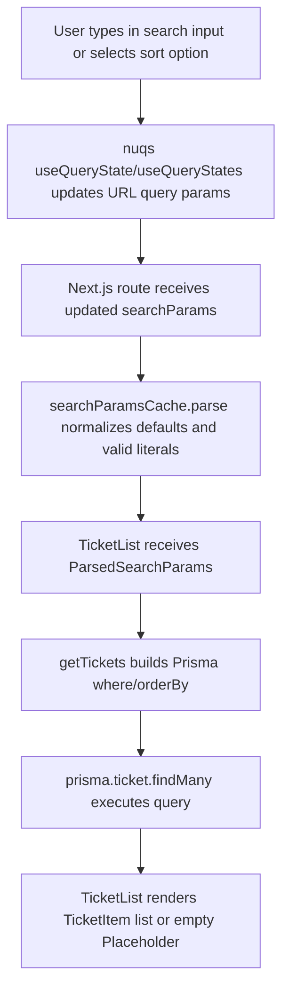

# Search And Sort Implementation

This document describes the current ticket search and sort implementation across route parsing, URL state syncing, UI controls, and Prisma query construction.

## Scope

Search and sort are implemented for both ticket listing routes:

- `/` (all tickets)
- `/(authenticated)/tickets` (current user's tickets)

Both routes parse query params with the same parser config and pass parsed values to `TicketList`.

## High-Level Flow

## Route-Level Wiring

### Home tickets route (`/`)

File: `src/app/page.tsx`

- Receives route `searchParams` as `Promise<Record<string, string | string[] | undefined>>`.
- Parses params via `searchParamsCache.parse(searchParams)`.
- Passes parsed params into `TicketList`.
- Uses `Suspense` + `TicketListSkeleton` while ticket list resolves.

### Authenticated tickets route (`/tickets`)

File: `src/app/(authenticated)/tickets/page.tsx`

- Uses the same `searchParamsCache.parse(searchParams)` flow.
- Fetches user via `getAuth()`.
- Passes both `userId` and parsed params to `TicketList`.
- Reuses the same search/sort behavior while scoping results to the current user.

## Search Params Parsing (`nuqs`)

File: `src/features/ticket/search-params.tsx`

The project uses `nuqs/server` parsers and cache:

- `searchParser`:
  - parser: `parseAsString`
  - default: `""`
  - options: `{ shallow: false, clearOnDefault: true }`
- `sortParser.sortKey`:
  - parser: `parseAsStringLiteral(["createdAt", "bounty"])`
  - default: `"createdAt"`
  - options: `{ shallow: false, clearOnDefault: true }`
- `sortParser.sortValue`:
  - parser: `parseAsStringLiteral(["asc", "desc"])`
  - default: `"desc"`
  - options: `{ shallow: false, clearOnDefault: true }`

`searchParamsCache` combines these into one parse contract and returns `ParsedSearchParams`.

Practical URL keys are now:

- `search`
- `sortKey`
- `sortValue`

Because `clearOnDefault` is enabled, default values are omitted from the URL.

## Client Controls

### Search UI

Files:

- `src/features/ticket/components/ticket-search-input.tsx`
- `src/components/search-input.tsx`

Behavior:

- `TicketSearchInput` uses `useQueryState("search", searchParser)`.
- Base `SearchInput` is a controlled input (`value` + `onChange`).
- Every change writes through `nuqs` setter.
- Empty input returns to the parser default (`""`), and with `clearOnDefault: true`, `search` is removed from URL.

### Sort UI

Files:

- `src/features/ticket/components/ticket-sort-select.tsx`
- `src/components/sort-select.tsx`

Behavior:

- `TicketSortSelect` uses `useQueryStates(sortParser)`.
- Base `SortSelect` works with a `SortObject` shape:
  - `sortKey`: `"createdAt"` | `"bounty"`
  - `sortValue`: `"asc"` | `"desc"`
- Option values are encoded as a composite string (`<sortKey>_<sortValue>`) and decoded on selection.
- Current options rendered by `TicketList`:
  - `createdAt + desc` labeled `Newest`
  - `bounty + desc` labeled `Bounty`

## Server List Component

File: `src/features/ticket/components/ticket-list.tsx`

`TicketList` is an async server component that:

1. Receives already parsed `ParsedSearchParams`.
2. Calls `getTickets(userId, searchParams)` directly.
3. Renders search and sort controls.
4. Renders `TicketItem` list, or `Placeholder` when no results.

No additional manual normalization of arrays is needed because parsing is handled upstream by `searchParamsCache`.

## Query Layer (Prisma)

File: `src/features/ticket/queries/get-tickets.tsx`

`getTickets(userId, searchParams)` uses parsed params to construct Prisma query parts:

### where

- `userId` is always included in `where`; when undefined it does not constrain results.
- Title search is always present as:
  - `title.contains = searchParams.search`
  - `title.mode = "insensitive"`

Given the parser default is empty string, `contains: ""` effectively matches all titles when search is not provided.

### orderBy

`orderBy` is selected from parsed sort key:

- if `sortKey === "bounty"` -> `{ bounty: sortValue }`
- else -> `{ createdAt: sortValue }`

With current UI options, effective sort choices are:

- newest first (`createdAt desc`)
- highest bounty first (`bounty desc`)

The parser also supports `asc`, so ascending order is valid if supplied in URL.

### include

The query includes ticket creator username:

- `include.user.select.username = true`

## End-To-End Behavior Summary

- Client controls sync search/sort state to URL using `nuqs`.
- Route components parse and validate URL params via `searchParamsCache`.
- `TicketList` receives typed parsed params and fetches data.
- Prisma applies user scope, case-insensitive title filter, and dynamic sort.
- UI re-renders with filtered and ordered tickets.

## Defaults, Validation, And Edge Cases

- **Default search:** empty string (`search=""`); URL key omitted due to `clearOnDefault`.
- **Default sort:** `sortKey="createdAt"` + `sortValue="desc"`; keys omitted when default.
- **Invalid sort literals:** rejected by parser and replaced by defaults.
- **Search matching:** case-insensitive (`mode: "insensitive"`).
- **Ascending support:** parser and query support `asc` even though current UI only exposes `desc` presets.

## Implementation References

- Route (all tickets): `src/app/page.tsx`
- Route (my tickets): `src/app/(authenticated)/tickets/page.tsx`
- Search/sort parser: `src/features/ticket/search-params.tsx`
- Ticket list bridge: `src/features/ticket/components/ticket-list.tsx`
- Ticket search binder: `src/features/ticket/components/ticket-search-input.tsx`
- Ticket sort binder: `src/features/ticket/components/ticket-sort-select.tsx`
- Base search input: `src/components/search-input.tsx`
- Base sort select: `src/components/sort-select.tsx`
- Data query: `src/features/ticket/queries/get-tickets.tsx`
