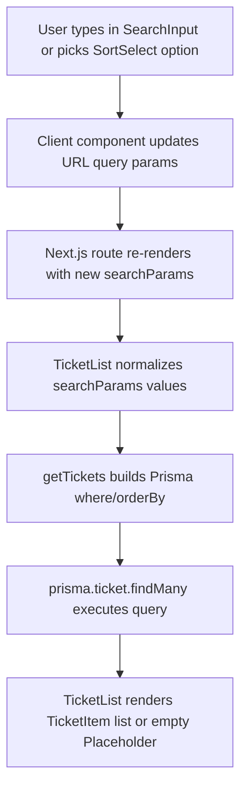

# Search And Sort Implementation

This document describes the complete implementation of ticket search and sort across routes, UI controls, URL query params, server components, and database queries.

## Scope

Search and sort are implemented for both ticket listing surfaces:

- `/` (all tickets)
- `/(authenticated)/tickets` (current user's tickets)

Both routes pass `searchParams` into the same list component (`TicketList`), so behavior is shared.

## High-Level Flow

## Route-Level Wiring

### Home tickets route (`/`)

`src/app/page.tsx`:

- Accepts `searchParams` in `HomePage`.
- Passes `searchParams` to `TicketList`.
- Uses `Suspense` with `TicketListSkeleton` while async list data resolves.

### Authenticated tickets route (`/tickets`)

`src/app/(authenticated)/tickets/page.tsx`:

- Accepts `searchParams` in `TicketsPage`.
- Loads authenticated user via `getAuth()`.
- Passes both `userId` and `searchParams` to `TicketList`.
- Reuses the same search/sort implementation as the home route, but with user filtering.

## Search Params Types

`src/features/ticket/search-params.tsx` defines two levels:

- `SearchParamsRaw`: allows `string | string[] | undefined` for each key (matching Next.js route param shape).
- `SearchParams`: supports both direct object and promised object (`SearchParamsRaw | Promise<SearchParamsRaw>`), since server components can receive async `searchParams`.
- `SearchParamsValue`: normalized value consumed by the data layer (`search?: string`, `sort?: string`).

This split keeps the route and component contracts type-safe while isolating normalization logic.

## UI Controls (Client Components)

## 1) Search Input

File: `src/components/search-input.tsx`

- Uses Next navigation hooks: `useSearchParams`, `usePathname`, `useRouter`.
- On input change, uses a 300ms debounce (`useDebouncedCallback`) to avoid re-render/query spam.
- Builds `URLSearchParams` from current query string.
- Writes `search` when there is text.
- Deletes `search` when input is empty.
- Calls `router.replace()` with `scroll: false` so filtering does not push browser history entries and does not jump the page.

Result: URL becomes:

- `?search=bug`
- or clears back to no `search` key.

## 2) Sort Select

File: `src/components/sort-select.tsx`

- Uses the same Next navigation hooks.
- Receives:
  - `defaultValue` (current usage: `"newest"`)
  - `options` (current usage: `"newest"` and `"bounty"`)
- On selection:
  - if selected value equals `defaultValue`, deletes `sort` from URL
  - otherwise sets `sort=<value>`
- Uses `router.replace(..., { scroll: false })`.
- Initializes select value from URL (`searchParams.get("sort")`) and falls back to `defaultValue`.

Result:

- Default ordering is represented by no `sort` key in URL.
- Explicit non-default ordering is represented by `?sort=bounty`.

## Server List Component

File: `src/features/ticket/components/ticket-list.tsx`

`TicketList` is an async server component and acts as the bridge between URL params and the query layer.

Steps:

1. Awaits `searchParams`.
2. Normalizes `search` and `sort` from possible array values to single strings (first array element).
3. Calls `getTickets(userId, paramsOrUndefined)`, passing search/sort only when at least one value exists.
4. Renders:
   - `SearchInput`
   - `SortSelect`
   - ticket list (mapped `TicketItem`) or `Placeholder` when empty.

Current sort options passed into `SortSelect`:

- `newest` (default)
- `bounty`

## Query Layer (Prisma)

File: `src/features/ticket/queries/get-tickets.tsx`

`getTickets(userId?, searchParams?)` builds dynamic Prisma conditions:

### where

- Adds `userId` filter only when `userId` is provided (used on authenticated tickets route).
- Adds case-insensitive title search when `searchParams.search` is present:
  - `title contains <search>`
  - `mode: "insensitive"`

### orderBy

Current implementation:

- `sort === "bounty"` -> `{ bounty: "desc" }`
- all other cases -> `{ createdAt: "desc" }`

So practical sort behavior is:

- default or unknown sort value => newest first
- bounty sort => highest bounty first

### include

The query includes the ticket creator username:

- `include.user.select.username = true`

This supports rendering metadata in list items without an additional query.

## End-To-End Behavior Summary

- User changes search/sort in client controls.
- URL query string is updated with debounced search and immediate sort changes.
- Route re-renders with new `searchParams`.
- `TicketList` normalizes params and fetches tickets via `getTickets`.
- Prisma applies user scope, title search, and sorting.
- UI updates with matching and ordered tickets.

## Defaults, Fallbacks, And Edge Cases

- **Default sort:** newest first (`createdAt desc`), represented by missing `sort` query param.
- **Unknown sort values:** fallback to newest first.
- **Empty search input:** removes `search` param and disables text filtering.
- **Array query params:** first value is used (`search[0]`, `sort[0]`).
- **Debounce behavior:** search waits 300ms before URL update.
- **History behavior:** both controls use `router.replace`, so each change does not create new browser history entries.

## Implementation References

- Route (all tickets): `src/app/page.tsx`
- Route (my tickets): `src/app/(authenticated)/tickets/page.tsx`
- Search/sort list bridge: `src/features/ticket/components/ticket-list.tsx`
- Search input: `src/components/search-input.tsx`
- Sort select: `src/components/sort-select.tsx`
- Query params typing: `src/features/ticket/search-params.tsx`
- Data query: `src/features/ticket/queries/get-tickets.tsx`
